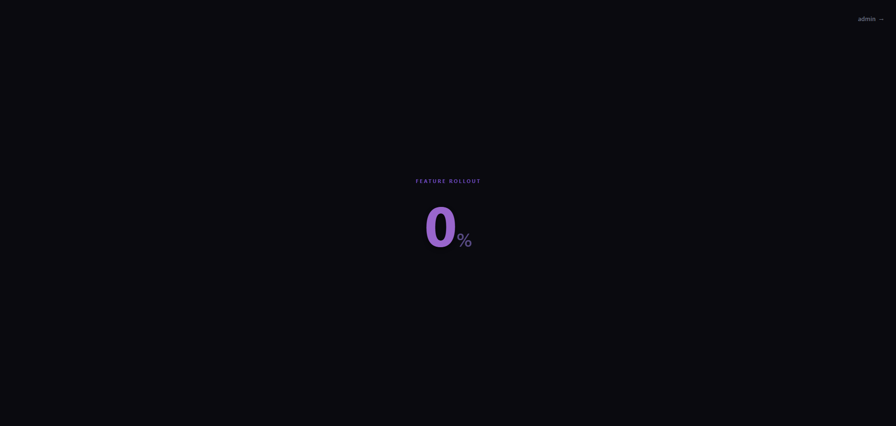
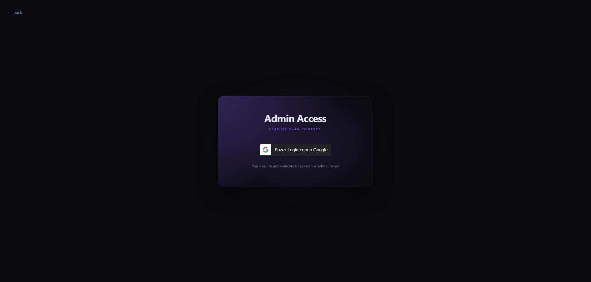
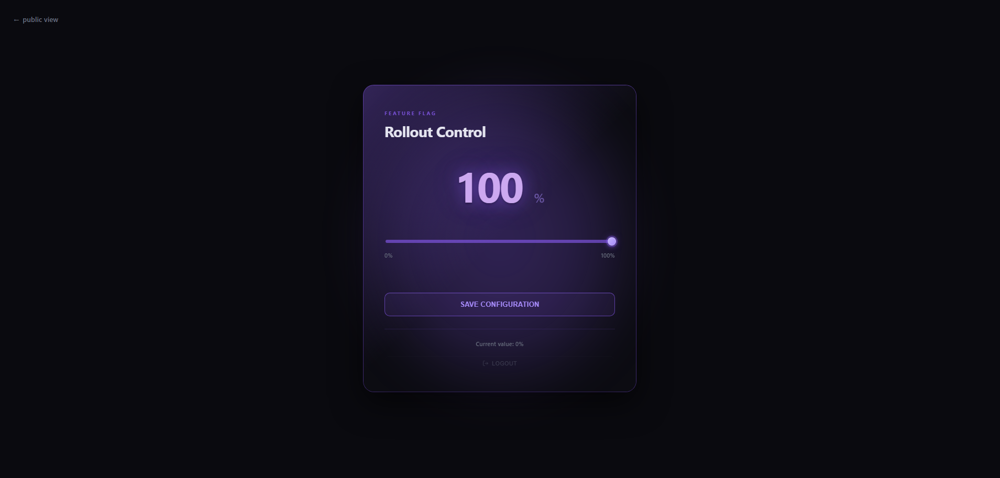

# Feature Flag UI

Frontend application for a **feature flag system with percentage-based rollout control**.

This project provides a clean and modern interface to visualize feature rollout status and, for authorized users, manage rollout percentages in real time.

---

## Overview

**Feature Flag UI** is the frontend layer of a feature rollout system designed to work with a backend API that controls business rules and authorization.

The goal of this project is to demonstrate:
- dynamic UI behavior driven by backend configuration
- separation between public and administrative views
- Google Sign-In integration for admin access
- a simple and intuitive rollout management experience

---

## Application flow

### Public view
- Displays the current rollout percentage
- No authentication required
- Read-only access

### Admin area
1. User clicks **Admin**
2. Redirected to the login screen
3. Authenticates using **Google Sign-In**
4. Gains access to the admin dashboard

From the admin dashboard, the user can:
- Adjust the rollout percentage using a slider
- Save changes
- Return to the public view
- Log out

All confirmation actions use **SweetAlert (Swal)** for user feedback.

---

## User Interface

Below are screenshots of the main application screens.

### Home


### Login


### Admin Area


The admin area allows authorized users to manage feature rollout percentages in real time.

---

## UI and design

The interface follows a dark theme with:
- purple and neon accents
- minimal and focused layout
- emphasis on readability and interaction clarity

The rollout percentage is the main visual element, keeping the interface simple and direct.

---

## Authentication

Authentication is handled using **Google Identity Services**.

The frontend:
- retrieves a Google JWT token
- sends the token to the backend API
- does not perform authorization logic locally
- relies entirely on the backend for access control

---

## Environment configuration

The application uses an environment file to define API communication and Google authentication settings.

Example:

```ts
export const environment = {
  production: false,
  apiUrl: 'https://localhost:7067',
  googleClientId: 'YOUR_GOOGLE_CLIENT_ID'
};